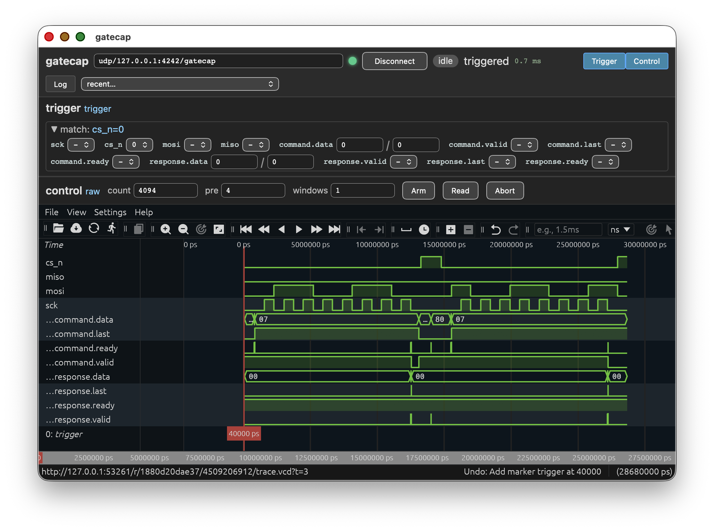

Graphical interface
===================

::

   acrobe gatecap gui                                   # start disconnected
   acrobe gatecap -r udp/127.0.0.1:4242/gatecap gui      # autoconnect
   acrobe gatecap serve                                 # headless: serve for a browser

``gui`` opens a window on the local display; ``serve`` hosts the identical
interface over HTTP for a third-party browser — for a target plugged into a
machine that has no display, reached through an SSH tunnel (see
:doc:`cli`). Everything below applies to both.

   Capturing an SPI transaction on the ``spi_example`` bench: connection bar,
   then the analyzer's panel — trigger editor, capture controls, waveform.

The window is built from the core's self-description, so it shows your
signals under your names, with the controls your configuration calls for — an
RLE core asks for a duration where a normal one asks for a sample count, and
an edge-triggered core offers edges where a value-triggered one does not.

Connecting
----------

The top bar holds the resource path, a *Connect*/*Disconnect* button and a
drop-down of recently used targets. Next to them, the state of the link
itself: the connection indicator, the round-trip time to the core, and a
*stale* marker if the gateware changed under the session.

One panel per instrument
------------------------

The window shows one panel per instrument the core holds — a logic analyzer,
a control/status panel, a clock measurer, a bus explorer — and nothing below
that: the blocks
an instrument is built from are sections of its panel, not surfaces of their
own. The buttons
at the right show and hide them, one button per instrument, and an instrument
that reports live status carries its own pill there: its state (a logic
analyzer shows *idle*, *armed*, *capturing*, *reading*, marked when the
trigger has fired), coloured by how much it wants your attention, with the
progress — elapsed capture time, buffer fill, completed windows, or which
domain the group is waiting on — in its tooltip. Each instrument reports for
itself, and keeps reporting while its panel is hidden. The *Log* button opens
the session log.

.. _gui-analyzer-panel:

Logic analyzer panel
--------------------

Top to bottom: the analyzer and its capture domains, one editor per trigger
the core holds, the capture controls, and the waveform.

Trigger
~~~~~~~

One editor per trigger field, in the order the gateware named them, with a
summary line at the top showing the condition as it currently stands
(``match: cs_n=0``).

* A scalar is a small drop-down: don't-care, 0 or 1 — plus *rising* and
  *falling* on a core built with the edge trigger.
* A bus takes a value and a mask, so you can constrain part of it.
* A field carrying an enumerated table offers its labels by name.

Changing the condition writes it straight to the trigger hardware; *Arm* only
arms. An analyzer whose domains watch more than one trigger shows one editor
per trigger, each named after the block it drives.

Capture
~~~~~~~

The capture parameters, and *Arm*, *Read* and *Abort*.

A single capture domain is captured in its own samples: the sample count, the
pre-trigger length and the number of windows to fill, or — for an RLE core —
the pre-trigger ring size and the post-trigger time cap. Values the core
cannot honour — more samples than the buffer holds, more windows than it was
built with — are refused with the reason, before anything is armed.

Several correlated domains (see :doc:`../usage/client`) are armed and
read as one, and the window is stated in time instead, in microseconds —
*span*, and how much of it precedes the trigger — because the domains sample
at different rates, so a sample count would mean a different stretch of the
capture on each of them. Arming reports what each domain derived from it, and
says so when a domain's buffer could not hold the whole span. A
run-length-encoded domain instead takes a *pre-lines* ring, in buffer lines,
since the time a ring covers is what the captured data decides; an analyzer
mixing both kinds shows both fields, labelled with the domains they drive.

*Arm* starts a capture and the waveform refreshes when it completes; *Read*
re-reads the buffer without re-arming; *Abort* stops a capture that is waiting
for a trigger that will not come — the pre-trigger content is still readable.
All three act on every domain at once, and the waveform of a correlated
capture is the composed trace: one scope per domain, each on its own sample
grid, all aligned on the trigger instant they share.

*Reset view*, at the far right of the row, discards the waveform arrangement
— the saved one included — and rebuilds the default view from the last
capture: every signal, default order and radix, markers on the trigger.

Next to it, the *VCD* link appears once a capture has been read: it downloads
the trace the waveform is showing as a VCD file, named after the instrument
and the capture's serial number.

.. _gui-panel-pane:

Control/status panel
--------------------

A control/status instrument (see :doc:`../instrument/index`) shows a panel
of plain widgets — no capture, no waveform — built from what the core said it
holds. Each signal gets the widget its kind, width and value table call for:

* a **control** of one bit is a checkbox, a wider one an entry, and one
  carrying an enumerated table a drop-down of its labels. Double-clicking the
  name of a plain entry switches it between hexadecimal and binary, and the
  choice is remembered across sessions. Writing happens as you act on the
  widget; nothing is staged, and nothing polls a control back afterwards.
* a **status** of one bit is an LED, a wider one a value — double-click its
  name for binary, as for a control — and an enum-bound one its label. They
  refresh on every status poll.
* a **tick output** is a push button, which fires a one-cycle pulse in the
  gateware. A word packing several of them adds a checkbox per tick and a
  *together* button: that single write is what makes them assert in the same
  cycle. Ticks of *different* words have no such button, because two writes
  are two cycles — the description's grouping is what decides.
* a **tick input** is a counter readout that highlights while its sticky bit
  says something happened, with a *reset* that clears the bit and rebases the
  counter to zero.

The whole live panel — statuses, sticky bits and counters — comes from one
burst read per poll, and the instrument's pill in the top bar reports *event*
while any tick input holds an unacknowledged one, naming them in its tooltip.

Two limits are worth knowing, because they are the hardware's and not the
window's. The panel acknowledges exactly the sticky bits a poll reported, so an
event on any *other* input is never cleared unread; one landing on one of
those very bits between the read and the clear is, though — its flash goes
with the flash you saw, since the host cannot bound how long that round trip
takes. The counter caught it all the same: the count, not the highlight, is
the record of what happened. A *reset* likewise rebases the count rather than
stopping the gateware from counting, so no event is lost to it either.

.. _gui-rates-pane:

Clock-measurer pane
-------------------

A clock-rate measurer (:ref:`clock-measurer-instrument`) shows what it watches
and what it reads: the reference clock and its nominal rate, how often the
rates refresh and to what resolution, then one row per observed clock with its
current rate, and a graph of the recent history of those rates.

There is nothing to drive here — the measurement is free-running — so the pane
is fed by the status poll like every other, and its pill reports *measuring*,
or *stopped* when a clock reads zero, naming it in the tooltip. A clock that
has stopped is exactly what this instrument is for noticing.

The checkbox beside each clock selects the curves drawn, and **the y-axis is
scaled to the selected clocks alone**: a 100 MHz clock and a 32 kHz one on one
axis would flatten the slow one into the baseline, so pick the ones you want to
compare. The selection is remembered per instrument, so it survives a
reconnect and follows the gateware rather than the link it was reached over.

.. _gui-bus-pane:

Bus-explorer pane
-----------------

A bus explorer (:ref:`bus-explorer-instrument`) gives you a target register map
to work in, in four rows:

* **access** — address, data and mask entries with *read* and *write*. This is
  the row that works with no register map at all: type an address, read it,
  write it. An empty mask writes the whole word; anything else is a
  read-modify-write the gateware performs on the target. Double-clicking an
  entry's name switches the row between hexadecimal and binary, and the choice
  is remembered across sessions.
* **registers** — the registers of interest, which are the instrument's scan
  slots. *add address* puts the address from the access row into a slot, the
  *scan* checkbox starts the round-robin sweep, and the table then shows each
  slot's address, the name the map gives it, its last value and its valid and
  error flags. Those values arrive on the ordinary status poll, so watching a
  handful of registers live costs the link nothing extra. Clicking a row reads
  that register and shows its fields below.
* **fields** — the field breakdown of the selected register: a drop-down where
  the map declares enumerated values, an entry otherwise, and nothing editable
  where the map says read-only. **Editing a field is a masked write**: the map
  turns the field into a mask, and the instrument does the read-modify-write
  against the target, so the other fields of that register are never written
  back from a stale copy.
* **journal** — every write this session made. *listing* shows it as text, one
  line per write with the register and field names it was decoded to at the
  time; *recipe* shows the same writes as a document carrying the addresses,
  values and masks that were actually driven, which *replay* re-executes
  against the target. Copy either out — the recipe replays on a host with no
  map registered, since the names in it are commentary. *clear* starts a fresh
  record.

The pill in the top bar reports *idle*, *busy*, *scanning*, or *error* when an
access failed or a scan slot is erroring, naming the offenders in its tooltip.

With no map loaded the register column stays empty and the field row says so:
raw hexadecimal is a working mode, not a degraded one.

Waveform
--------

Traces are shown in an embedded `Surfer <https://surfer-project.org/>`_
viewer: dotted names become scopes, ranges become buses, enumerated fields
show their labels, and a marker sits on the trigger. When the core advertises
its sampling frequency, the axis is in real time.

A new capture reloads the viewer in place: signal order, grouping, colors,
display formats, your own markers and the zoom survive, and the trigger
markers move to where the new capture puts them. *Reset view* in the capture
row brings back the default arrangement.

Across sessions
---------------

Recently used targets are remembered, and so is each panel's state — the
trigger conditions, the capture parameters, the display bases, the waveform
arrangement — keyed to the instrument's identity rather than to the
transport, so the same core reached over a different link comes back
configured as you left it.

If the link drops, reconnecting rebuilds the transport and replays that
configuration onto the hardware. If the FPGA has meanwhile been reprogrammed
with a *different* capture configuration, the fingerprint no longer matches:
the window says so and re-enumerates instead of showing you a trace with
stale names.
