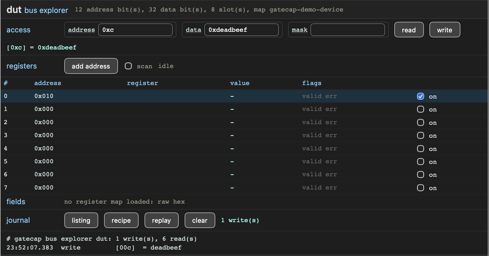

.. _bus-explorer-instrument:

Bus explorer
============

A ``!bus-explorer`` instrument is a bus *master*: it drives one APB port into
your design, on the host's behalf, so you can read and write a register map
that gatecap does not own — a transceiver's DRP port, a PLL reconfiguration
interface, a third-party IP block's register file. Peek and poke a register,
flip a field, watch another register react, and take away the list of writes
that got you there.

   A bus explorer with generic read-write, register polling and
   action journal.

Description
-----------

.. code-block:: yaml

   instruments:
     gt0: !bus-explorer
       clock: drpclk            # the target bus's own clock; optional
       address-width: 10        # required, 1 to 32
       data-width: 16           # required, 1 to 32
       slots: 16                # registers kept live; optional, 1 to 32
       map: xilinx-gtye4-drp    # optional; what the host looks the map up by
       timeout: 65536           # optional, in host clock cycles

The two dimensions are the ones with no sane default — an explorer of the
wrong width explores nothing — so state both; everything else has one. An
instance costs the standard 1 KB of address space whatever its dimensions, so
a transceiver quad is four instances.

Every access is indirect
------------------------

There is **no pass-through window** onto the target bus, and that is
deliberate. A target that never answers — a transceiver held in reset, a DRP
whose clock is stopped — would stall the access forever, and a stalled access
wedges the whole rack: the link would go dead exactly in the situation the
tool exists for. So the host stages an operation in registers and fires it, the
instrument runs it against the target under a timeout, and the result comes
back as data or as an error code (``timeout``, ``slverr``). A dead target costs
one timeout and nothing else; the rest of the rack never notices.

``timeout`` is that budget, in host clock cycles, and 65536 is generous enough
that only a target which never answers reaches it.

.. warning::

   An abandoned access is held open until the target eventually answers, which
   is what bounds the instrument to one lost access instead of a queue of
   them. A target that stalls for far longer than the timeout is therefore
   still holding that access when you fire the next command, and **that
   command times out too**. If your target can legitimately take a long time
   to answer, size ``timeout`` on its slowest access, not on its typical one.

Registers of interest
---------------------

``slots`` is how many target addresses the instrument keeps *live*. You program
an address into a slot and enable it; the instrument then reads the enabled
slots round-robin whenever it is otherwise idle, and their values ride the same
status poll that every instrument answers — so a table of the registers you are
watching costs the link nothing beyond the poll it already does. Each slot
carries a valid and an error flag beside its value, and a slot that starts
erroring keeps the last value it read.

Slots are opt-in, which is also the answer to registers that must not be read
casually: a read-to-clear register simply gets no slot.

Generated ports
---------------

The target bus, and the clock it runs on:

.. code-block:: vhdl

   gt0_drpclk_i  : in  std_ulogic;
   gt0_reset_n_i : in  std_ulogic;

   gt0_target_o  : out nsl_amba.apb.master_t;   -- the instrument drives
   gt0_target_i  : in  nsl_amba.apb.slave_t;    -- the target answers

``<instance>_target_o``/``_target_i`` is an APB **master** pair: the instrument
is the requester and your design is the completer. Its address bus is
``address-width`` bits and its data bus is the next of 8, 16 and 32 bits at or
above ``data-width``, with the unused high bits driven low.

**Bridging is yours.** A DRP port, a vendor reconfiguration interface or a
hand-rolled register file is not APB, so write the shim that turns this port
into whatever the target speaks — it is a small state machine, and it is where
the target's addressing convention belongs: the instrument drives the address
you give it onto ``paddr`` verbatim and never scales a word address into a byte
address. The explorer adds no generic to the rack: every dimension is settled
by the description.

The clock
---------

``clock`` names the clock the *target bus* runs on, as a plain identifier —
the middle name of its port, ``<instance>_<clock>_i``, and the clock it exports
as ``<instance>.<clock>`` for the transport to ride. The reset port is always
``<instance>_reset_n_i``.

Unlike a control/status panel, this clock need not be permanent: the instrument
only ever acts when you ask it to, and nothing is missed while it is stopped —
an access simply does not complete, and times out. Leave ``clock`` out and the
target bus runs on the host clock, with no clock port and no crossing at all;
the same collapse happens when the clock named is the very one
``communication.clock`` made the rack ride.

Naming the map
--------------

``map`` is an identifier, not a map: printable ASCII that rides the
self-description and means nothing to the gateware. The host resolves it
against SVD documents *you* register (``acrobe gatecap bus map add``,
:doc:`../host/cli`) and shows register names, fields and enumerated values when
it finds one — falling back to raw hexadecimal when it does not, which is a
working mode and not a degraded one. Register maps run to hundreds of registers
describing somebody else's IP, so they stay on the host and out of the
bitstream.

Drive the target with ``acrobe gatecap bus`` (:doc:`../host/cli`) or from the
GUI (:ref:`its pane <gui-bus-pane>`).
