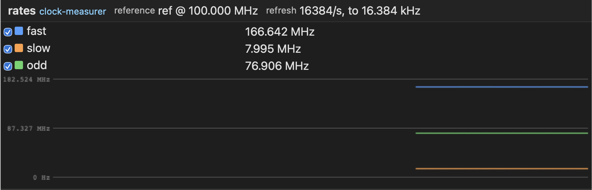

.. _clock-measurer-instrument:

Clock-rate measurer
===================

A ``!clock-measurer`` instrument reports how fast the clocks of your design
actually run — not what the constraints asked for, what the board does. One
reference clock carries the time base, and every other clock you name is
counted against it and published as a rate in hertz, refreshed continuously
from reset. It takes nothing of your design but the clocks themselves.

   A clock measurer measuring three clocks and graphing their backlog

Description
-----------

.. code-block:: yaml

   instruments:
     clkmon: !clock-measurer
       reference: sysclk            # the time base; port clkmon_sysclk_i
       frequency: 100_000_000       # its nominal rate, in Hz
       clocks: [rxclk, txclk, ref]  # observed clocks, in register order
       max_rate: 200_000_000        # the highest rate you expect
       update_hz_l2: 0              # optional; see below

``reference`` / ``frequency``
   The clock every measurement is taken against, and the rate it is stated to
   have. It is the only rate the design states, and the measurement is a
   *ratio*: an error there scales every published rate by the same factor.

``clocks``
   The observed clocks, at least one. The order is the order of the rate
   registers and of the names in the self-description, and each becomes a port
   ``<instance>_<clock>_i``. The reference is not one of them — it measures the
   others.

``max_rate``
   The highest rate any observed clock is expected to reach. It sizes the rate
   registers, and must fit 32 bits: a rate is published in one word. A clock
   running faster than this reads wrong rather than saturating, so state a
   ceiling, not a hope.

``update_hz_l2``
   How often rates refresh, as a log2 of refreshes per second; 0 (the default)
   is once per second. **It is also the resolution**: the instrument counts
   edges over one window and scales the count back to hertz, so a rate is a
   multiple of ``2**update_hz_l2`` Hz. Once per second is what a rate in hertz
   wants — the count *is* the rate, rounded nowhere.

The default is the value for hardware, and the one value a simulation has to
change: a one-second window is not something a testbench reaches. The
``clock_rates`` bench (:doc:`../developer/simulation`) uses 14, a ~61 µs window
with rates to the nearest 16384 Hz.

What the description settles is checked before any VHDL exists — a
``max_rate`` needing more than 32 bits, an ``update_hz_l2`` leaving no counting
bits in the rate, or one making the window shorter than two reference cycles::

   Error: instruments.clkmon: update_hz_l2 28 leaves no counting bits in the 28-bit rate max_rate 200000000 asks for: a rate is a multiple of 2**update_hz_l2 Hz

Generated ports
---------------

Clocks, and nothing else — the instrument adds no generic to the rack either,
since the description fixes everything:

.. code-block:: vhdl

   clkmon_sysclk_i : in std_ulogic;   -- the reference
   clkmon_rxclk_i  : in std_ulogic;   -- observed, in description order
   clkmon_txclk_i  : in std_ulogic;
   clkmon_ref_i    : in std_ulogic;

The reference clock is exported as ``<instance>.<reference>``, so a rack may be
told to ride it (``clock: clkmon.sysclk`` under ``communication``) — a rack
whose only clock is the one it measures against then needs no clock port of its
own. Its footprint is the standard 1 KB.

Read the rates with ``acrobe gatecap rates`` (:doc:`../host/cli`) or watch them
in the GUI (:ref:`its pane <gui-rates-pane>`).
