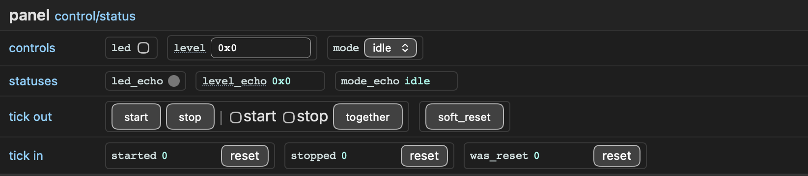

.. _control-status-instrument:

Control/status
==============

Not everything you want from a board is a waveform. A ``!control-status``
instrument is a front panel of plain wires: levels you drive into the design,
levels you watch, buttons that fire a one-cycle pulse, and event inputs that
are counted whether or not you are looking. No capture, no trigger, no buffer
— and no ``capture`` command either: a panel is driven from the GUI
(:ref:`its panel <gui-panel-pane>`) or from Python.

   A control status panel with various control shown

Description
-----------

.. code-block:: yaml

   instruments:
     panel: !control-status
       clock: clk               # the panel's own clock, permanent
       tick-counter-width: 8    # bits per event counter (default 32)

       control:
         led: 1
         dac_level: 12
         mode:
           width: 2
           enum:
             0: idle
             1: run
             2: test

       status:
         busy: 1
         error_code:
           width: 4

       tick-out:
         - [ start, stop ]      # one word: strobed together, in one cycle
         - [ soft_reset ]

       tick-in:
         - [ overflow, underflow ]

A panel needs at least one signal, and names each of them once whatever the
kind: the names are boundary ports, so they must be VHDL identifiers and must
not collide.

Signals
-------

``control``
   Levels the host writes, driven to outputs, 1 to 32 bits each. A control is
   read back from the register that holds it, which is what lets a host
   reattaching to a running board show what the hardware actually holds
   instead of a default.

``status``
   Levels the design drives, sampled continuously, 1 to 32 bits each.

Both take a width directly, or a mapping of ``width`` and ``enum`` — the same
value tables as elsewhere (:doc:`logic_analyzer/enums`), so the host shows and
offers labels instead of numbers. A table mapping a value the field cannot hold
is refused::

   Error: instruments.panel.control.mode.enum: enum maps value 4 beyond the 2-bit control

``tick-out``
   Events the host fires: a write asserts the named outputs for exactly one
   cycle of the panel's clock.

``tick-in``
   Events the design fires: one-cycle pulses. Each owns a sticky bit and a
   free-running counter, both kept on the panel's clock, so an event is never
   missed however slow or absent the host is. ``tick-counter-width`` sizes
   every counter of the instance, 1 to 32 bits; counters wrap at it.

Both are a list of *words*, and a word is a list of tick names — up to 32 of
them. **The grouping is the simultaneity guarantee**: one write fires one
word, so the ticks written together assert in the same cycle, with no skew to
argue about. Ticks in different words cannot fire together at all, however
quickly the two writes follow each other. Group what must be simultaneous, and
say so in the description rather than hoping for it:

.. code-block:: yaml

   tick-out:
     - [ arm_a, arm_b ]     # these two are guaranteed simultaneous
     - [ clear_stats ]      # this one is not simultaneous with them

The clock
---------

``clock`` names the panel's own clock, as a plain identifier — that is the
middle name of its port, ``<instance>_<clock>_i``, and the clock it exports as
``<instance>.<clock>`` for the transport to ride. The reset port is always
``<instance>_reset_n_i``.

**That clock must be permanent.** The host-side clock is not: a JTAG TCK only
runs while the probe drives it, and a link that stops between accesses would
stop the counters and lose the pulses with it. So the instrument is two
halves — the register file on the host clock, the event logic on yours — with
the crossings between them generated. Give the panel a free-running clock of
the design, not one gated with the logic it watches.

Leaving ``clock`` out puts the whole panel on the host clock: no clock port,
no crossings, and the caveat above becomes yours to honour on the rack's own
clock instead. The same collapse happens when the panel's clock is the very
one ``communication.clock`` made the rack ride — the port stays, since that is
where the rack takes the clock from, but there is nothing left to cross.

Generated ports
---------------

One port per signal, prefixed with the instance name, one bit wide as
``std_ulogic`` and wider as ``unsigned``:

.. code-block:: vhdl

   panel_clk_i        : in  std_ulogic;
   panel_reset_n_i    : in  std_ulogic;

   panel_led_o        : out std_ulogic;                  -- control, 1 bit
   panel_dac_level_o  : out unsigned(11 downto 0);       -- control, 12 bits
   panel_mode_o       : out unsigned(1 downto 0);
   panel_busy_i       : in  std_ulogic;                  -- status, 1 bit
   panel_error_code_i : in  unsigned(3 downto 0);
   panel_start_o      : out std_ulogic;                  -- tick out
   panel_stop_o       : out std_ulogic;
   panel_soft_reset_o : out std_ulogic;
   panel_overflow_i   : in  std_ulogic;                  -- tick in
   panel_underflow_i  : in  std_ulogic;

Ticks are always one bit: the packing into words is internal, and the boundary
knows nothing of it. A panel adds no generic to the rack — every width and
grouping is settled by the description — and its footprint is the same 1 KB
whatever it holds, since its register map is the standard one.

Tick inputs are sampled on the panel's clock, so a pulse must be one cycle of
*that* clock wide, exactly as a probe must belong to the domain sampling it
(:doc:`logic_analyzer/clocking`).
