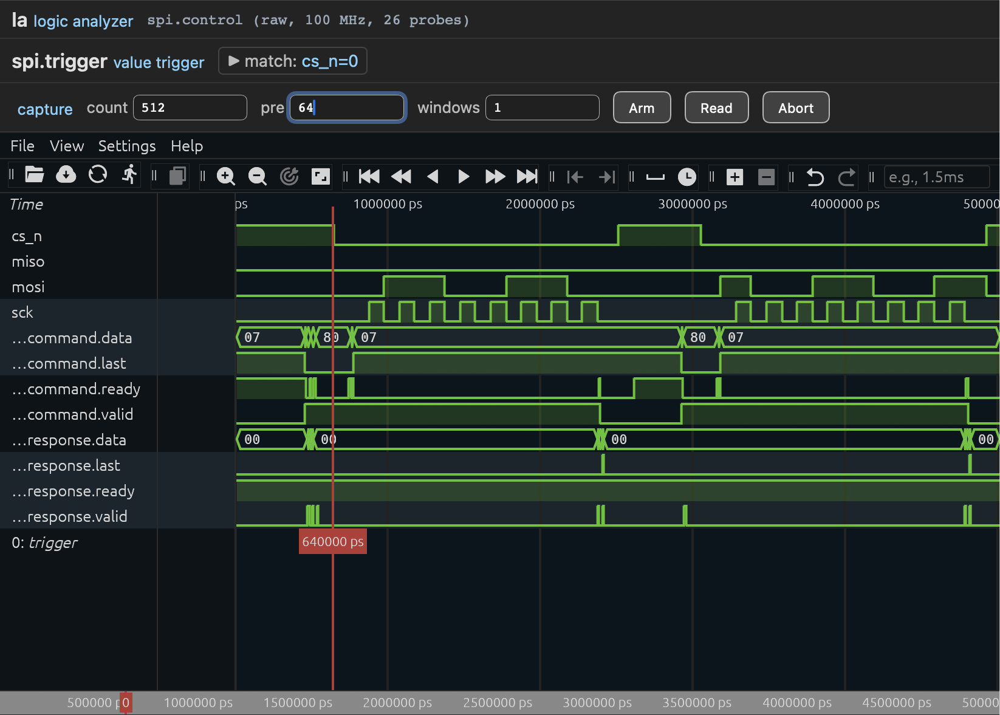

.. _logic-analyzer-instrument:

Logic analyzer
==============

A logic analyzer's description settles more than a list of probes: how the
signals are named and grouped for the host, what labels a field carries, which
trigger, storage and capture modes the core is fitted with, and which clock
each domain is sampled on. This chapter is those four subjects — what the
choices mean, what they cost, and where they exclude each other.

   A logic analyzer showing a capture of two stream busses and a SPI
   interface.

The logic analyzer description covers the usual cases, and the host adapts to
whatever you asked for:

* **Trigger modes** — a value/mask match on the current sample, or an
  edge trigger matching a transition (rising, falling, or an arbitrary
  old→new pair). The trigger watches its *own* signal vector, which may be
  a subset of the probes, or signals that are not captured at all.

* **Storage modes** — one sample per memory word, byte-lane packing for
  narrow probe sets (several samples per word), or wide samples spanning
  several words when you probe more than a machine word's worth of signals.

* **Capture control** — post-trigger capture, pre-trigger capture (the
  buffer is a ring until the trigger fires), segmented multi-window capture
  (several trigger events kept back-to-back in one buffer), and run-length
  encoding (long stable stretches cost two memory lines instead of
  thousands, so a slow event stays affordable).

* **Clocking** — sample on the clock the signals belong to, even when it is
  asynchronous to the clock the host link runs on.

Description
-----------

A ``!logic-analyzer`` watches signals and stores them: one or more capture
domains, each with its own clock, its own trigger and its own trace buffer,
armed together as one group when they share a trigger. This is the instrument
the ``capture`` command drives and the waveform comes from.

Its body has four sections — ``storage``, ``capture``, ``trigger`` and
``domains``. The first three set defaults for every domain of *that* analyzer;
the fourth is where the signals are.

Dimensioning
------------

``storage.buffer_depth_l2``
   Trace buffer depth in samples, as a power of two (default 10). The
   capture-length register is sized from it, so the longest capture a domain
   accepts follows its buffer.

``storage.packed``, ``storage.rle``
   Byte-lane packing, or run-length encoding. Same meaning and same
   trade-offs as the modes in :doc:`capture-modes`; the two are
   mutually exclusive, and RLE requires a single window.

``capture.max_windows``
   Maximum number of segmented capture windows (default 1).

``trigger.capabilities``
   ``value`` (default) or ``edge``, the two trigger flavours of
   :doc:`capture-modes`.

A domain overrides any of them with a section of the same shape; unset keys
keep the analyzer's default. Asymmetric domains usually want different
geometries — a fast bus deep and packed, a slow one run-length encoded:

.. code-block:: yaml

   instruments:
     la: !logic-analyzer
       storage:
         buffer_depth_l2: 8
       capture:
         max_windows: 4
       trigger:
         capabilities: edge

       domains:
         transceiver_rx:
           clock: rxclk
           frequency: 125_000_000
           storage:
             buffer_depth_l2: 10     # deeper than the analyzer's default
             packed: true
           signals:
             word: !bus
               width: 8
               trigger: true

         slow:
           frequency: 1_000_000
           storage:
             rle: true
           capture:
             max_windows: 1
           trigger:
             capabilities: value
           signals:
             sda: {trigger: true}
             scl: {trigger: true}

Wide samples need no key: a probe vector wider than a bus word spans several
words on its own.

Domains and clocks
------------------

Every entry under ``domains`` is one capture clock domain, with its own
trigger, capture datapath and trace buffer. Its key is the domain name, which
prefixes every port of the domain and every block the host sees under the
analyzer.

``clock``
   The clock port's middle name: ``clock``, the default, gives
   ``<instance>_<domain>_clock_i``, ``rxclk`` gives
   ``<instance>_<domain>_rxclk_i``. The reset port is always
   ``<instance>_<domain>_reset_n_i``.

``frequency``
   Sampling rate in Hz, advertised to the host so the waveform gets a time
   axis. Left out, the host counts samples.

Domains are independent: nothing requires their clocks to be related,
and the crossings between each of them and the register clock are part
of the generated instrument. When a domain's clock is the one the rack
itself runs on, those crossings collapse and cost nothing.

Signals
-------

Each entry under a domain's ``signals`` is one probe. The YAML tag picks its
type; the bit order of the capture vector is the order they are written in.
This domain uses every type there is:

.. code-block:: yaml

   domains:
     main:
       clock: clock
       frequency: 100_000_000

       signals:
         mark: {}
         grant:
         address: !bus
           width: 12
         state: !bus
           width: 2
           trigger: true
           enum:
             0: IDLE
             1: BUSY
             2: HOLD
             3: DONE
         command: !axi4-stream
           trace: dvlr
           trigger: vl
         req: !bnoc-framed
           trace: dvl
           trigger: v
         rx: !bnoc-pipe {}
         fault:
           trace: false
           trigger: true

Bare scalar
   An entry with no tag — an empty mapping, or nothing at all — is one
   ``std_ulogic`` probe. ``mark`` and ``grant`` above are the two spellings.

``!bus``
   A ``std_ulogic_vector`` of a fixed ``width``. Widths live in the
   description, never in a generic: the host-visible geometry of a bus is
   decided here.

``!axi4-stream``
   A whole AXI4-Stream bus, packed by the gateware. ``trace`` and ``trigger``
   take element strings over the ``idskouvlr`` alphabet — id, data, strobe,
   keep, dest, user, valid, last, ready — the same selection the packing
   helpers of :doc:`signals` use.

   Without a ``trace`` key the whole alphabet is captured. Letters are a
   request, not an assertion: a field the probed bus is not configured for
   contributes no bit and no name, so the vector and the description cannot
   disagree. Each stream adds one rack generic, see
   :ref:`rack-stream-generics`.

``!bnoc-framed``
   A whole ``nsl_bnoc.framed.framed_bus_t``, packed by the gateware.
   ``trace`` and ``trigger`` take element strings over the ``dvlr``
   alphabet — data (8 bits), valid, last, ready.

``!bnoc-pipe``
   The same for a ``nsl_bnoc.pipe.pipe_bus_t``, which carries no frame
   boundary: its alphabet is ``dvr`` — data (8 bits), valid, ready.

   Both bnoc types default to their whole alphabet when ``trace`` is absent,
   and both add *no* generic: a bnoc bus has one fixed geometry, so the
   probe's width is settled by the description alone. Selections are checked
   against the 32-bit trigger limit when the description is read, rather than
   at elaboration the way an ``!axi4-stream`` selection has to be.

Three keys apply to any signal:

``trigger``
   Opt-in inclusion in the domain's trigger vector: ``true`` for a scalar or
   a bus, an element string for an abstract bus type. Absent means the signal
   is not a trigger source. A domain whose signals carry no ``trigger``
   marking hosts no trigger.

``trace: false``
   Keep the probe out of the capture vector; it then only feeds the trigger —
   ``fault`` above is triggered on and not stored. Signals are traced by
   default, so ``trace: true`` is refused as redundant.

``enum``
   A value table on a scalar or a bus. The host shows the labels in the
   waveform, in CSV and in the trigger editor, exactly as the in-line tables
   of :doc:`enums`; keys are values and need not be consecutive,
   and a value with no label renders as a number. An abstract bus type names
   its own fields, so an enum cannot attach to one.

Trigger topology
----------------

A domain whose signals carry ``trigger`` markings **hosts** a trigger block
watching them. That is the default, and with a single domain it is the whole
story.

A domain may instead **subscribe** to another domain's trigger, within the
same analyzer:

.. code-block:: yaml

   phy:
     clock: clock
     frequency: 125_000_000
     trigger:
       from: control
     signals:
       word: !bus
         width: 8

Hosting and subscribing are exclusive — a subscriber marks no signal as a
trigger source — and every capturing domain needs one or the other. A
subscribing domain has no trigger block of its own; it gets the hosting
domain's trigger tick, resynchronised into its clock.

Operationally, a shared trigger is a rendezvous:

* **Every participating domain must be armed before the trigger can fire.**
  The trigger is enabled only once every subscriber's capture core is ready,
  so a condition going by while one domain is still idle is ignored. Arm all
  of them, then wait.
* **The windows are correlated.** One event cuts every buffer, and each
  domain back-dates its trigger marker by the latency of its own crossing, so
  index 0 of each trace is the same instant in absolute time — even though
  the domains count in different cycles.

Sharing stops at the instrument boundary: a domain of one analyzer cannot
subscribe to a domain of another, which is exactly what makes two analyzers
two independent groups.

A trigger vector is capped at 32 signals *per domain*, as everywhere else in
gatecap; capture vectors are not. A description whose trigger markings exceed
the cap is refused::

   Error: instruments.la.domains.sample: trigger vector is 40 bits, at most 32 are supported

Generated ports
---------------

A clock and a reset per domain, and one port per probe, of the width or the
bus record its type implies:

.. code-block:: vhdl

   la_main_clock_i   : in std_ulogic;
   la_main_reset_n_i : in std_ulogic;

   la_main_mark_i    : in std_ulogic;                        -- bare scalar
   la_main_address_i : in std_ulogic_vector(11 downto 0);    -- !bus
   la_main_command_i : in nsl_amba.axi4_stream.bus_t;        -- !axi4-stream
   la_main_req_i     : in nsl_bnoc.framed.framed_bus_t;      -- !bnoc-framed

Probes are connected raw, as signals of their own domain
(:doc:`clocking`), and each ``!axi4-stream`` probe brings one
generic with it (:ref:`rack-stream-generics`).

.. _rack-stream-generics:

AXI4-Stream configuration generics
----------------------------------

Each ``!axi4-stream`` probe adds one generic to the rack:

.. code-block:: vhdl

   <instance>_<domain>_<signal>_config_c : nsl_amba.axi4_stream.config_t

They have no default, deliberately. The capture geometry — how many bits the
bus contributes, which fields exist, what the probe names are — is computed
from that configuration at elaboration, by the same packer functions that
build the vector. A default that happened to elaborate would silently
describe a bus other than the one being probed. Pass the configuration
constant your design already uses for that bus, the one the producer and the
consumer were given.

Such a generic reaches further than the entity's ports: the instrument's
footprint, hence the address map and the descriptor, follow from it. That is
why the package publishes the envelope and the configuration as *functions* of
the instrument's generics rather than as constants — an elaboration constant
cannot flow up through an instantiation, so the rack and the backplane both
call the same function on the same generics instead.

More
----

.. toctree::
   :maxdepth: 2

   signals
   enums
   capture-modes
   clocking
