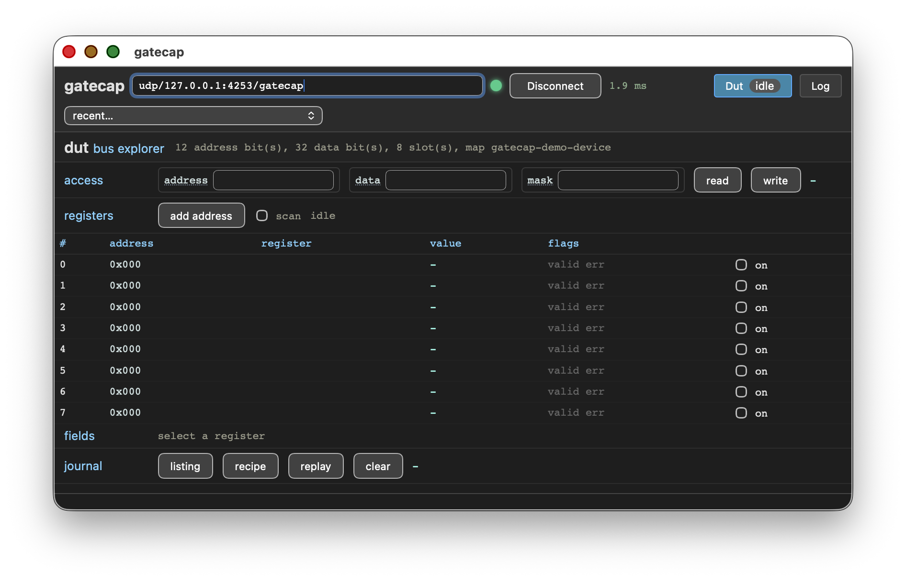

# Bus explorer demo

This platform demonstrates the usage for a gatecap bus explorer
instance connected to a mockup.

This platform is exposing a gatecap service on NSL's UDP transport for
AXI4-Stream.

## Building

Build and run the simulator:

    $ acrobe gatecap generate description.yaml -o generated
    description.yaml: rack busx_pkg.busx_core, 1 instrument(s) over axi4_stream
    wrote generated/busx_core_dut.vhd
    wrote generated/busx_pkg.pkg.vhd
    wrote generated/busx_core_backplane.vhd
    wrote generated/busx_core.vhd
    wrote generated/busx_pkg.gbs.yaml
    $ gbs project build
    $ ./tb --ieee-asserts=disable

In another shell:

    $ acrobe gatecap -r udp/127.0.0.1:4253/gatecap info
    dut:
      bus explorer: 12 address bit(s), 32 data bit(s), 8 scan slot(s)
      map gatecap-demo-device: no SVD document is registered as 'gatecap-demo-device' (acrobe gatecap bus map add gatecap-demo-device <file.svd>)
    $ acrobe gatecap -r udp/127.0.0.1:4253/gatecap gui

## Bus mapping

The stub is the device a bring-up session explores, small enough to assert
against and awkward enough to be worth exploring:

  0x000 ID       read-only, a constant; a write is accepted and ignored
  0x004 CTRL     read/write, three fields (ENABLE, MODE, GAIN)
  0x008 STATUS   read-only, computed from CTRL -- writing a field of one
                 register and watching another react is the whole shape of
                 the work this instrument exists for
  0x00c SCRATCH  read/write, a plain word
  0x010 MIRROR   read-only, SCRATCH inverted: a second feedback path, and
                 one no field decode is needed to check
  0x020 FAULT    always answers pslverr, as does every unmapped address
  0x024 SLOW     withholds pready far longer than the engine's timeout, so
                 the host sees a timeout and the late answer is drained

The register map above is what host/tests/data/demo_device.svd describes,
and what the description's `map: gatecap-demo-device` names.
