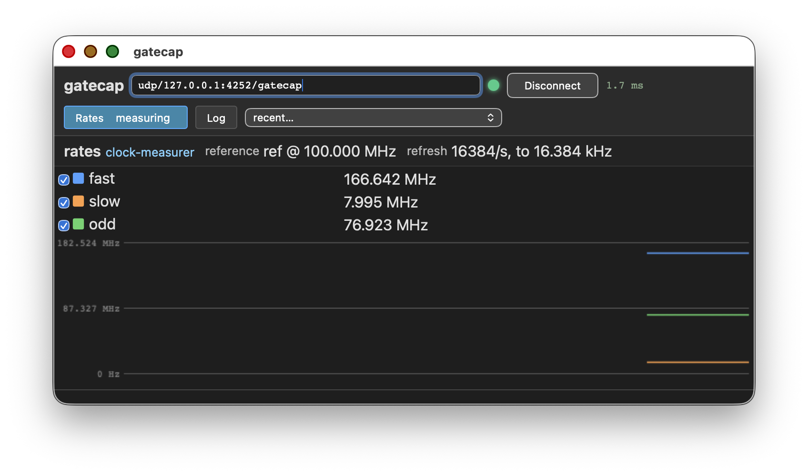

# Clock rate demo

This platform demonstrates the usage for a gatecap clock measurer
instance connected to a mockup.

This platform is exposing a gatecap service on NSL's UDP transport for
AXI4-Stream.

## Building

Build and run the simulator:

    $ acrobe gatecap generate description.yaml -o generated
    description.yaml: rack clkrate_pkg.clkrate_core, 1 instrument(s) over axi4_stream
    wrote generated/clkrate_pkg.pkg.vhd
    wrote generated/clkrate_core_backplane.vhd
    wrote generated/clkrate_core.vhd
    wrote generated/clkrate_pkg.gbs.yaml
    $ gbs project build
    $ ./tb --ieee-asserts=disable

In another shell:

    $ acrobe gatecap -r udp/127.0.0.1:4252/gatecap info
    rates:
      reference ref: 100 MHz nominal
      measured clocks (3): fast, slow, odd
      refreshed 16384 time(s) per second, to 16.384 kHz
    $ acrobe gatecap -r udp/127.0.0.1:4252/gatecap gui

