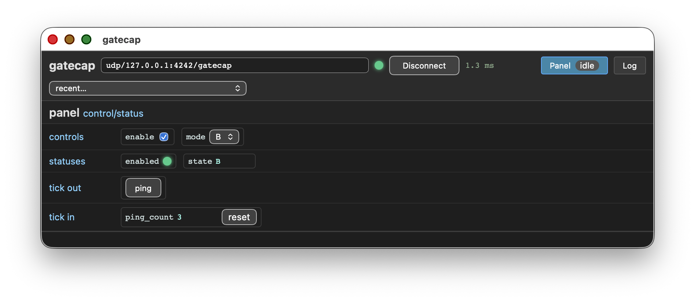

# Control/status demo

This platform demonstrates the usage for a gatecap control/status
instance connected to a mockup.

This platform is exposing a gatecap service on NSL's UDP transport for
AXI4-Stream.

## Building

Build and run the simulator:

    $ acrobe gatecap generate description.yaml -o generated
    description.yaml: rack cs.demo, 1 instrument(s) over axi4_stream
    wrote generated/demo_panel.vhd
    wrote generated/cs.pkg.vhd
    wrote generated/demo_backplane.vhd
    wrote generated/demo.vhd
    wrote generated/cs.gbs.yaml
    $ gbs project build
    $ ./tb --ieee-asserts=disable

In another shell:

    $ acrobe gatecap -r udp/127.0.0.1:4242/gatecap info
    panel:
      control/status panel
      control enable: 1 bit(s)
      control mode: 2 bit(s) <0=A, 1=B, 2=C>
      status enabled: 1 bit(s)
      status state: 4 bit(s) <0=A, 1=B, 2=C>
      tick out word 0: ping
      tick in word 0: ping_count
      counters: 1, 4 bit(s), wrapping
    $ acrobe gatecap -r udp/127.0.0.1:4242/gatecap gui

