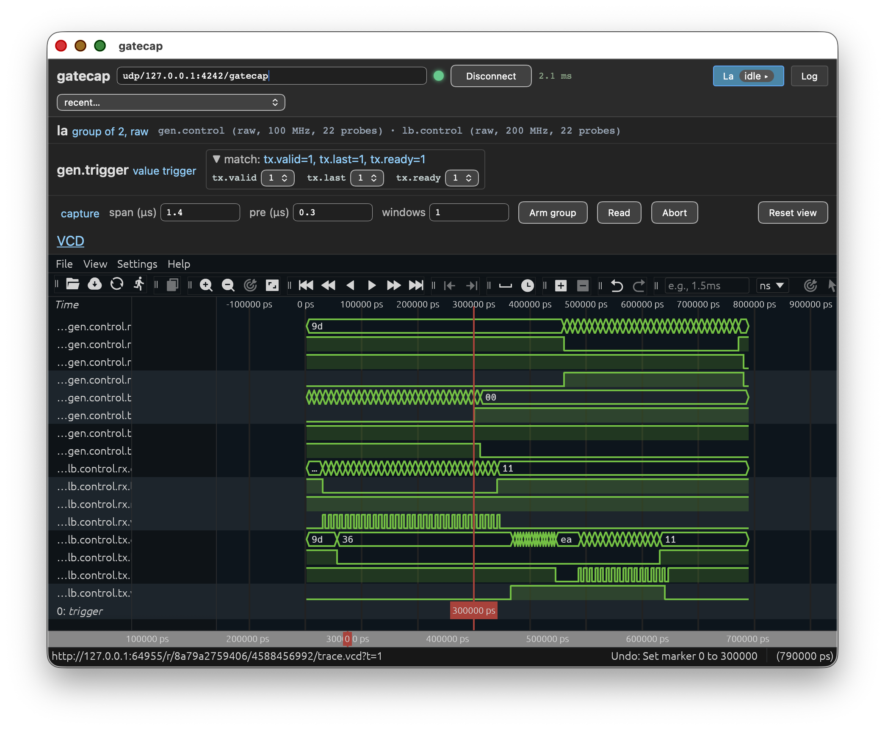

# Multi-domain waveform capture demo

This platform demonstrates the usage for a gatecap logic analyzer
instance connected to a mockup.  This mockup transfers data through
AXI4-Stream interfaces accross two clock domains.

This platform is exposing a gatecap service on NSL's UDP transport for
AXI4-Stream.

## Building

The rack's VHDL is generated from `description.yaml` as part of the
build; nothing has to be produced beforehand.

Build and run the simulator:

    $ gbs project build
    $ ./tb --ieee-asserts=disable

In another shell:

    $ acrobe gatecap -r udp/127.0.0.1:4242/gatecap info
    la:
      correlated capture group of 2 control(s)
      member gen.control: 22 probes, sample clock 100 MHz, trigger integration latency 0 cycle(s)
      member lb.control: 22 probes, sample clock 200 MHz, trigger integration latency 3 cycle(s)
    gen.control:
      probes (22): tx.data[0], tx.data[1], tx.data[2], tx.data[3], tx.data[4], tx.data[5], tx.data[6], tx.data[7], tx.valid, tx.last, tx.ready, rx.data[0], rx.data[1], rx.data[2], rx.data[3], rx.data[4], rx.data[5], rx.data[6], rx.data[7], rx.valid, rx.last, rx.ready
      trigger: value-mask match, up to 511 samples, up to 1 window(s), pre-trigger capable
      sample clock: 100 MHz
      sink gen.buffer: 32-bit samples, depth 256 samples
    gen.trigger:
      signals (3): tx.valid, tx.last, tx.ready
      value-mask match
    lb.control:
      probes (22): rx.data[0], rx.data[1], rx.data[2], rx.data[3], rx.data[4], rx.data[5], rx.data[6], rx.data[7], rx.valid, rx.last, rx.ready, tx.data[0], tx.data[1], tx.data[2], tx.data[3], tx.data[4], tx.data[5], tx.data[6], tx.data[7], tx.valid, tx.last, tx.ready
      trigger: value-mask match, up to 511 samples, up to 1 window(s), pre-trigger capable
      sample clock: 200 MHz
      sink lb.buffer: 32-bit samples, depth 256 samples

Do a headless capture:

    $ acrobe gatecap -r udp/127.0.0.1:4242/gatecap capture --trigger tx.valid=1 --trigger tx.ready=1 --trigger tx.last=1 --span 5us --pre 1us --output test.vcd la
    trigger over 3 signals: value=0x7 mask=0x7
      gen.control: 256 samples (2.6 µs), 100 pre-trigger (1.0 µs), 1 window(s)
      lb.control: 256 samples (1.3 µs), 200 pre-trigger (1.0 µs), 1 window(s)
      note: gen.control: 5.0 µs is 500 samples at 100 MHz, capturing 256 (2.6 µs)
      note: lb.control: 5.0 µs is 1000 samples at 200 MHz, capturing 256 (1.3 µs)
    armed; waiting for the trigger (Ctrl-C to stop) ...
    captured (vcd) to test.vcd

Or use GUI:

    $ acrobe gatecap -r udp/127.0.0.1:4242/gatecap gui

